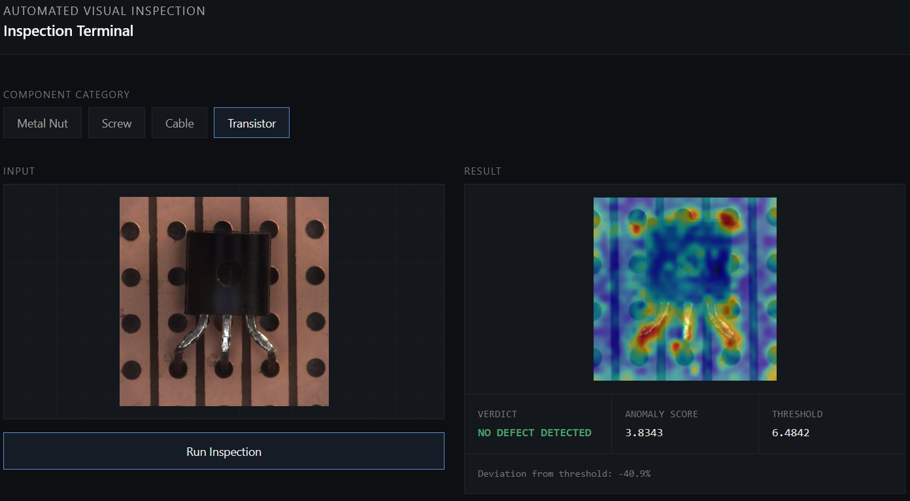
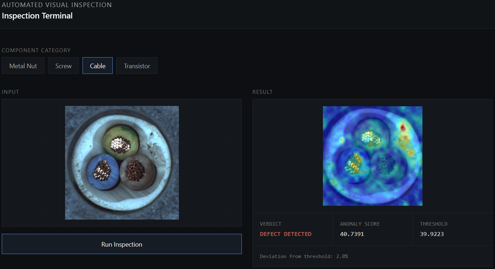
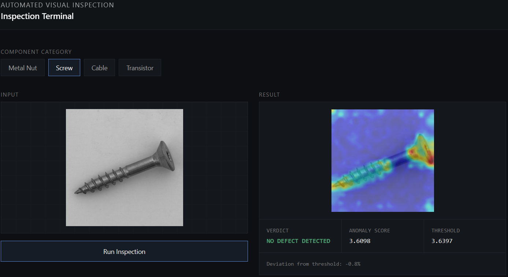
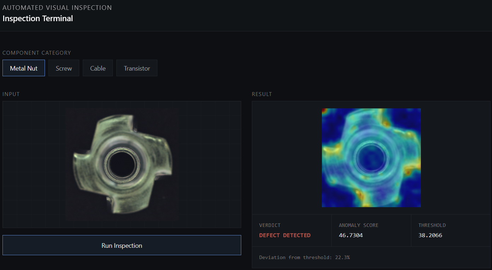

# Industrial Component Defect Detection

Unsupervised visual anomaly detection system for industrial components, built on PatchCore with a frozen Wide ResNet-50 backbone. Detects and localizes manufacturing defects across four MVTec AD categories without ever training on labeled defect examples.

## Categories

- Metal Nut
- Screw
- Cable
- Transistor

## Preview

<table>
  <tr>
    <td align="center"><br/><sub>Transistor</sub></td>
    <td align="center"><br/><sub>Cable</sub></td>
  </tr>
  <tr>
    <td align="center"><br/><sub>Screw</sub></td>
    <td align="center"><br/><sub>Metal Nut</sub></td>
  </tr>
</table>

## Architecture

- **Model**: PatchCore — frozen ImageNet-pretrained Wide ResNet-50 feature extractor, greedy k-center coreset memory bank, k-NN patch scoring.
- **Backend**: FastAPI, serving trained memory banks per category.
- **Frontend**: Next.js + Tailwind, deployed on Vercel.

## Project Structure

```
src/
  common/        shared PatchCore implementation, dataset loader
  metal_nut/     category-specific config, training, evaluation
  screw/
  cable/
  transistor/
backend/         FastAPI inference API
frontend/        Next.js web client
dataset/         MVTec AD category data (not included)
artifacts/       trained memory banks, thresholds, evaluation outputs
docs/            research paper (LaTeX + PDF), screenshots
```

## Running Locally

**Backend**
```
cd backend
pip install -r requirements.txt
uvicorn main:app --reload --port 8000
```

**Frontend**
```
cd frontend
npm install
npm run dev
```

## Training a Category

```
cd src/<category>
python train_patchcore.py
python calibrate.py      # if position calibration is enabled for this category
python evaluate.py
python run_visualizations.py
```

Tests:
```
pytest src/<category>/tests/ -v
```

## Documentation

Full methodology, experimental results, and per-category analysis: [`docs/paper.pdf`](docs/paper.pdf).
